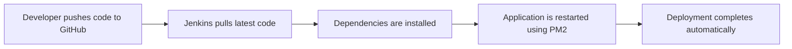

# CI/CD Pipeline for Flask & Express using Jenkins

<div align="center">


</div>

---

## 📌 Project Overview

This project demonstrates a complete **CI/CD pipeline** that automatically deploys:

- 🐍 **Flask Backend** (Python)
- 🌐 **Express Frontend** (Node.js)

The pipeline is implemented using **Jenkins** on an **AWS EC2 instance**, with **PM2** used as a process manager to keep applications running continuously.

Every push to GitHub can trigger automated deployment, ensuring **faster and reliable updates**.

---

## 🛠️ Tech Stack Used

| Category | Tools |
|----------|-------|
| **Cloud** | AWS EC2 (Ubuntu) |
| **CI/CD** | Jenkins |
| **Backend** | Flask (Python) |
| **Frontend** | Express.js (Node.js) |
| **Process Manager** | PM2 |
| **Version Control** | Git & GitHub |

---

## 📂 Project Structure

```
CI-CD_Project/
│
├── backend/
│   ├── app.py
│   ├── requirements.txt
│   ├── Jenkinsfile
│   └── venv/
│
├── frontend/
│   ├── app.js
│   ├── package.json
│   ├── Jenkinsfile
│   └── node_modules/
│
└── README.md
```

---

## 🎯 Objective

- ✅ Automate deployment of Flask and Express apps
- ✅ Use Jenkins pipelines for CI/CD
- ✅ Restart applications automatically using PM2
- ✅ Ensure apps remain live after server restarts

---

## ⚙️ Step-by-Step Implementation

### 1️⃣ AWS EC2 Setup

**Created an Ubuntu EC2 instance**

Opened required ports:
- `22` (SSH)
- `8080` (Jenkins)
- `3000` (Express)
- `5000` (Flask)

**Connected using SSH:**
```bash
ssh -i key.pem ubuntu@<EC2_PUBLIC_IP>
```

---

### 2️⃣ Install Required Software

#### Install Python & Node.js
```bash
sudo apt update
sudo apt install -y python3 python3-venv python3-pip nodejs npm
```

#### Install PM2
```bash
sudo npm install -g pm2
```

---

### 3️⃣ Run Applications with PM2

#### Flask Backend
```bash
cd backend
pm2 start app.py --name flask-app --interpreter python3
```

#### Express Frontend
```bash
cd frontend
pm2 start app.js --name express-app
```

**Verify:**
```bash
pm2 list
```

---

### 4️⃣ Install & Configure Jenkins

#### Install Jenkins
```bash
sudo apt install -y openjdk-17-jdk
sudo apt install -y jenkins
sudo systemctl start jenkins
sudo systemctl enable jenkins
```

**Access Jenkins:**
```
http://<EC2_PUBLIC_IP>:8080
```

**Unlock Jenkins:**
```bash
sudo cat /var/lib/jenkins/secrets/initialAdminPassword
```

**Installed required plugins:**
- Git
- Pipeline
- NodeJS
- Credentials Binding

---

### 5️⃣ Jenkinsfile for Flask Backend

**📄 backend/Jenkinsfile**

```groovy
pipeline {
    agent any

    stages {
        stage('Checkout Code') {
            steps {
                checkout scm
            }
        }

        stage('Install Dependencies') {
            steps {
                dir('backend') {
                    sh '''
                        python3 -m venv venv
                        venv/bin/pip install --upgrade pip
                        venv/bin/pip install -r requirements.txt
                    '''
                }
            }
        }

        stage('Restart Flask App') {
            steps {
                sh '''
                    pm2 restart flask-app || pm2 start backend/app.py --name flask-app --interpreter python3
                    pm2 save
                '''
            }
        }
    }

    post {
        success {
            echo "✅ Flask backend deployed successfully!"
        }
        failure {
            echo "❌ Flask backend deployment failed"
        }
    }
}
```

---

### 6️⃣ Jenkinsfile for Express Frontend

**📄 frontend/Jenkinsfile**

```groovy
pipeline {
    agent any

    stages {
        stage('Checkout Code') {
            steps {
                checkout scm
            }
        }

        stage('Install Dependencies') {
            steps {
                dir('frontend') {
                    sh 'npm install'
                }
            }
        }

        stage('Restart Express App') {
            steps {
                sh '''
                    pm2 restart express-app || pm2 start frontend/app.js --name express-app
                    pm2 save
                '''
            }
        }
    }

    post {
        success {
            echo "✅ Express frontend deployed successfully!"
        }
        failure {
            echo "❌ Express frontend deployment failed"
        }
    }
}
```

---

### 7️⃣ Jenkins Pipeline Configuration

**Created two Jenkins pipelines:**

| Pipeline Name | Jenkinsfile Path |
|---------------|------------------|
| flask-pipeline | backend/Jenkinsfile |
| express-pipeline | frontend/Jenkinsfile |

**Configuration:**
- **Pipeline type:** Pipeline script from SCM
- **SCM:** Git
- **Repository URL:** `https://github.com/deepMhabdi/CI-CD_Project.git`
- **Branch:** `main`

---

### 8️⃣ CI/CD Workflow



1. Developer pushes code to GitHub
2. Jenkins pulls latest code
3. Dependencies are installed
4. Application is restarted using PM2
5. Deployment completes automatically

---

## 🌍 Access the Applications

| Application | URL |
|-------------|-----|
| **Flask Backend** | `http://<EC2_PUBLIC_IP>:5000` |
| **Express Frontend** | `http://<EC2_PUBLIC_IP>:3000` |
| **Jenkins Dashboard** | `http://<EC2_PUBLIC_IP>:8080` |

---

## ✅ Final Outcome

- ✔ Fully automated CI/CD pipeline
- ✔ Zero-downtime deployments
- ✔ Separate pipelines for frontend & backend
- ✔ Production-ready DevOps workflow

---

## 🚀 Getting Started

### Prerequisites
- AWS Account
- GitHub Account
- Basic knowledge of Jenkins, Flask, and Express.js

### Clone the Repository
```bash
git clone https://github.com/deepMhabdi/CI-CD_Project.git
cd CI-CD_Project
```

### Local Development

#### Backend (Flask)
```bash
cd backend
python3 -m venv venv
source venv/bin/activate
pip install -r requirements.txt
python app.py
```

#### Frontend (Express)
```bash
cd frontend
npm install
node app.js
```

---

## 📝 License

This project is open source and available under the [MIT License](LICENSE).

---

## 🧑‍💻 Author

**Deep Mhabdi**  
Frontend Developer | DevOps Enthusiast

[](https://github.com/deepMhabdi)

---

## 🎉 Conclusion

This project demonstrates a **real-world CI/CD implementation** using Jenkins, AWS, Flask, and Express — covering deployment, automation, and process management end-to-end.

---

<div align="center">

**⭐ Star this repository if you found it helpful!**

</div>